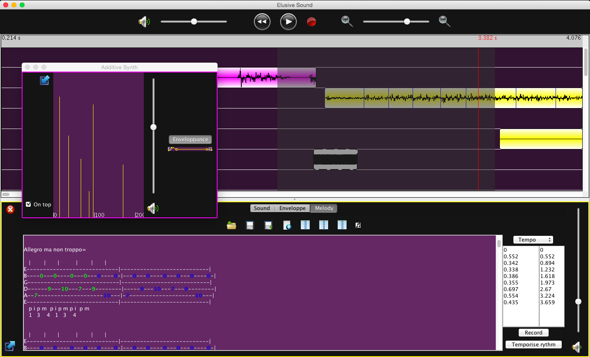

# ElusiveSound

[](https://www.meterian.com/report/gh/arnaudh/elusive-sound)

[](https://www.meterian.com/report/gh/arnaudh/elusive-sound)

Linear software music sequencer

- recording, editing and saving of audio content
- sound synthesis (additive, subtractive, AM, FM)
- tablature playback
- genetic algorithms

## Screenshots




## How to run

1. Compile

	```
	mvn compile
	```

2. Run

	```
	mvn exec:java
	```

## Disclaimer

Very buggy
